# 🦭 海豹骰日志后端-Worker版

一个抓包分析 + 询问开发者后自实现的海豹骰日志后端项目。

注意！本项目的编写者是Javascript初学者，建议目前尝鲜使用本项目，以免造成数据丢失！

## 优点

1. 自部署，数据全部由自己（？）掌控
2. 便宜。仅需要一个绑定在Cloudflare的域名即可使用
3. 安全。仅你自己的染色器可以访问（其实就是跨域配置）

## 限制

1. 免费版本的限制如下：


这意味着一天大概最多写入1000个日志。我想这个数量应该足够用了。

2. 需要一个域名，要花钱，不如白嫖来的舒服
3. 需要亿定的操作，涉及到编译，部署等相关。同时，你可能需要一个梯子。（部署完成后不需要，主要是Vercel部署部分需要梯子，如果你能自行部署染色器，则无所谓~~没准以后染色器能自己换地址呢~~）

> 如果您几乎是电脑小白，那么下面的教程可能对您有些困难。您或许需要一些技术dalao的帮助。
>
> 如果您本身就是开发者，那下面的东西可能对您没什么难度Orz

## 怎么用

### 提前准备：购买域名

首先注册一个cloudflare账号并绑定一个域名。这里以阿里云为例（可以选择腾讯，百度等其他域名，甚至你可以搜索一下tk免费域名，但一定要是能换绑到cloudflare的）：

首先转到https://wanwang.aliyun.com/domain/并登录一个账号。然后在上面搜索你想要的域名名称，比如此处以sealdiceisgood为例：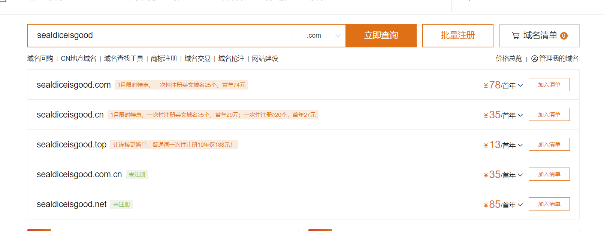

挑选好心仪（便宜）的域名之后直接花钱即可。之后参考：https://bbs.maozhishi.com/d/56-cloudflare 的方式，将域名换绑到cloudflare。

### 提前准备2：注册Github和Vercel

准备一把趁手的梯子，首先注册一个Github账号。Github地址：https://github.com/ 善用翻译，或者您可以参考：https://zhuanlan.zhihu.com/p/658727572。

之后利用梯子打开vercel网站：https://www.vercel.com/，并使用github登录。登录完成后大概长这样：

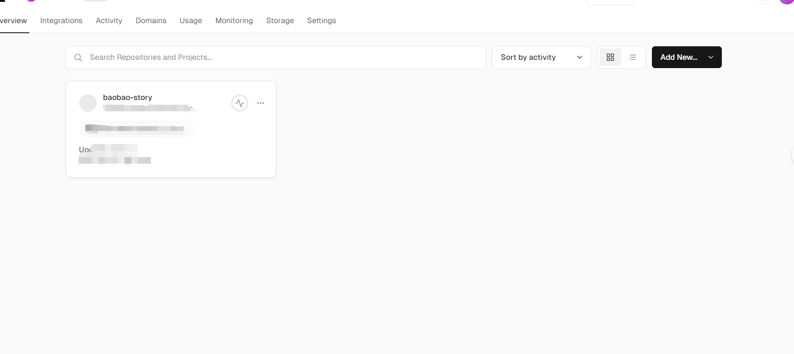

点击Add New，之后点击Project，然后点击：


之后在新出现的界面里，粘贴这个地址后点击continue：https://github.com/sealdice/story-painter.git

在红色方框处写一个你想的名字后点击Create：

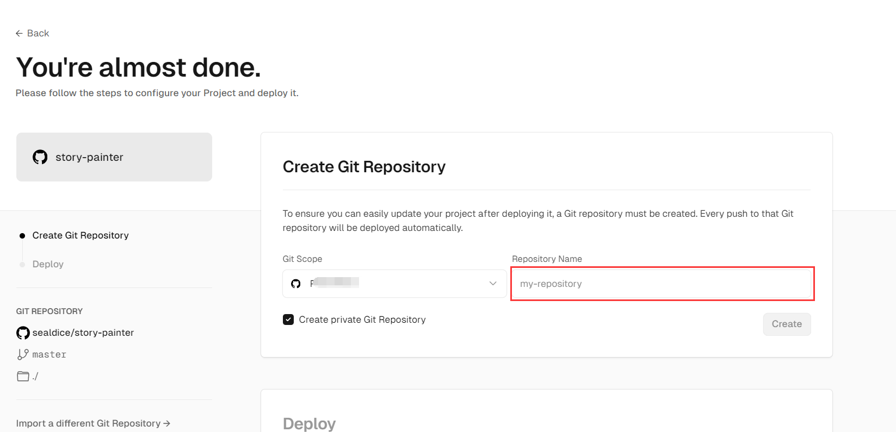


此时会这样：


等待一会儿后会变成这样：


保留这个页面，进行下一步。

## 绑定域名

打开cloudflare，找到你的域名：

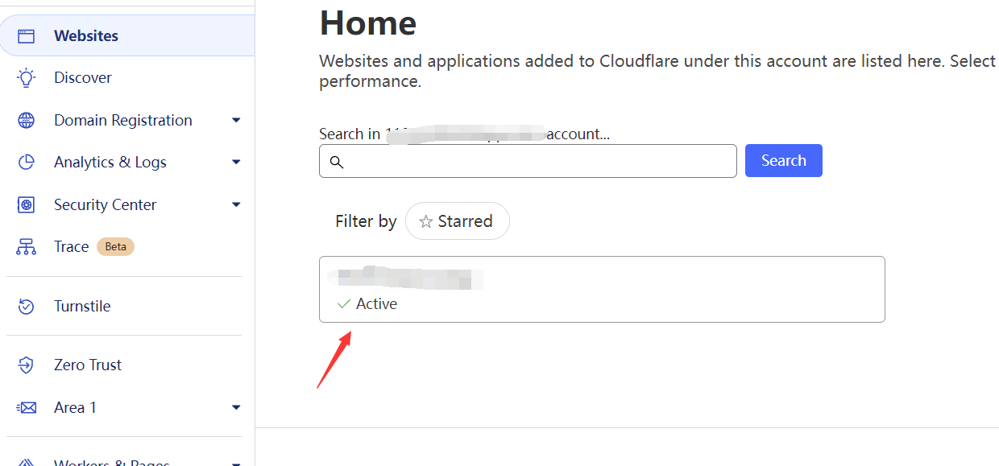


点击它，然后如图所示展开：

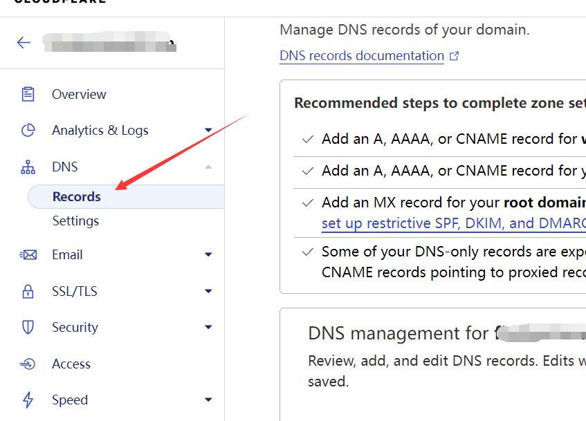

此时，转回刚刚这个界面：


点击Add Domain:


如图，xxxx是你自己起的，注意记住，比如我这里以myseal.example.com为例。设置好之后点Add。

第一次必然报错如下：

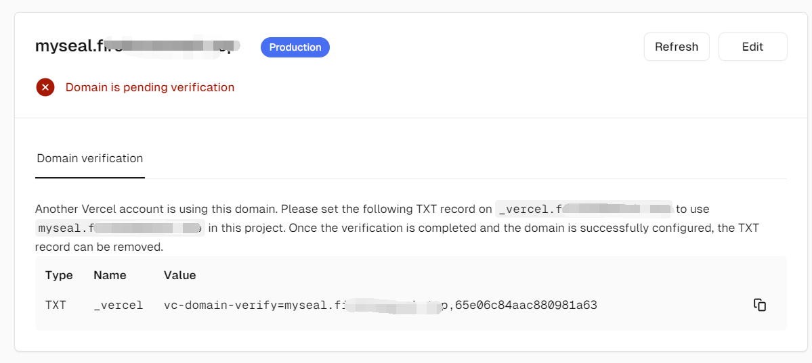

此时转回Cloudflare点Add Record:

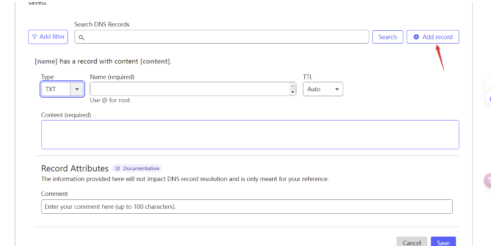

type选TXT，Name就是那个_vercel，Content是那个第三段内容，之后点Save保存。

回到刚刚的Vercel位置，点Refresh，会出现新报错，如图：


照葫芦画瓢，**但是注意，此处有一些不同**


完成后再次刷新，此时应该是可用状态，如图：


**记住你的地址myseal.example.com。我们一会儿就会用上它。**

## 创建Worker

到Cloudflare处，并点击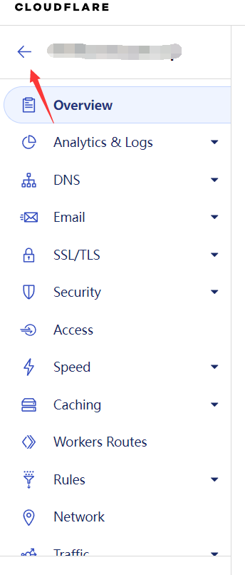

以返回。

找到：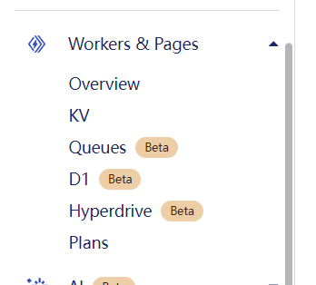

然后点击KV。在此处点击“Create Namespaces"


随便起个名（请记住这个名字下面要用），然后点击add：

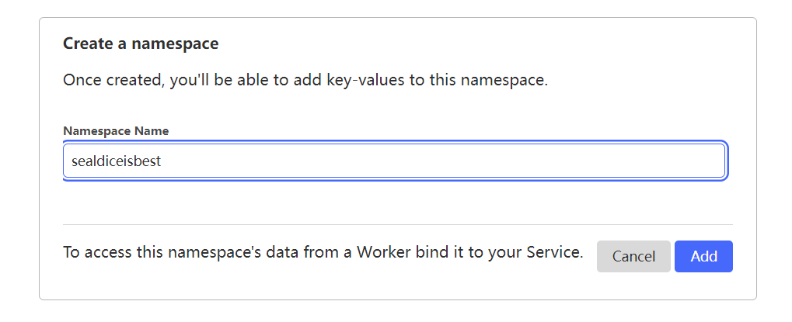

完成后，点击OverView，并点击Create Application:


之后点击Create Worker:

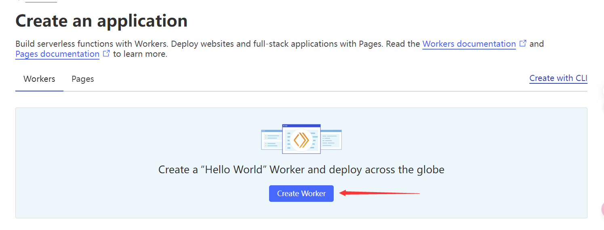

然后点击Deploy:


再点击Edit Code:

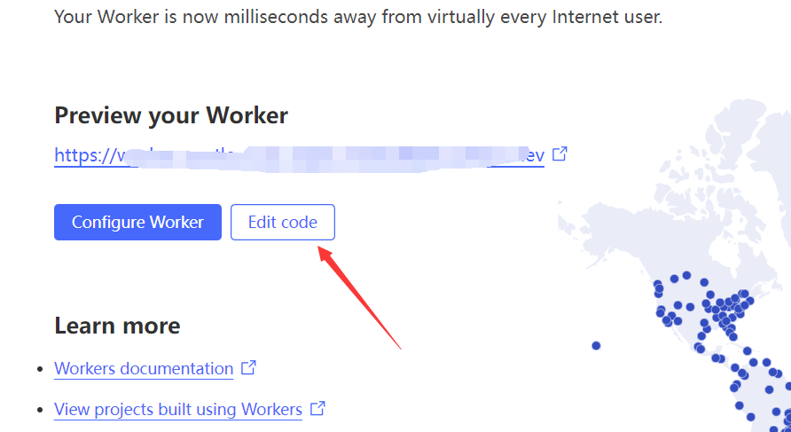


将本项目的src/worker.js里的内容复制粘贴到新出现的左侧页面里：

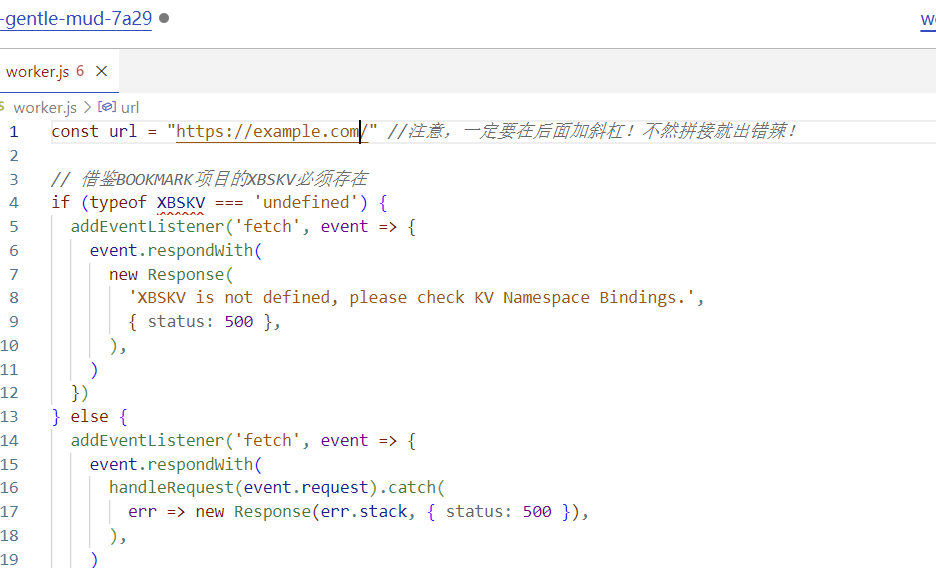

并将上一个步骤最后的地址，替换url的地址（注意那个斜杠别多了或者少了，以及不要复制两个https……）

比如我们这里的结果是这样的：


之后点击右上角的Save And Deploy。之后从左上角


这里返回。

接下来转到界面中的Triggers位置：


在此处点击：Add Custom Domain


在新出现的页面里，输入xxxxxxxxx.你的域名.你的后缀，xxxxxxxxx同样是自己随便起。


比如我们这里以这个地址为例(worker.example.com)

完成后点击Add Custom Domain，然后转到Settings：


左侧点击Varibles:

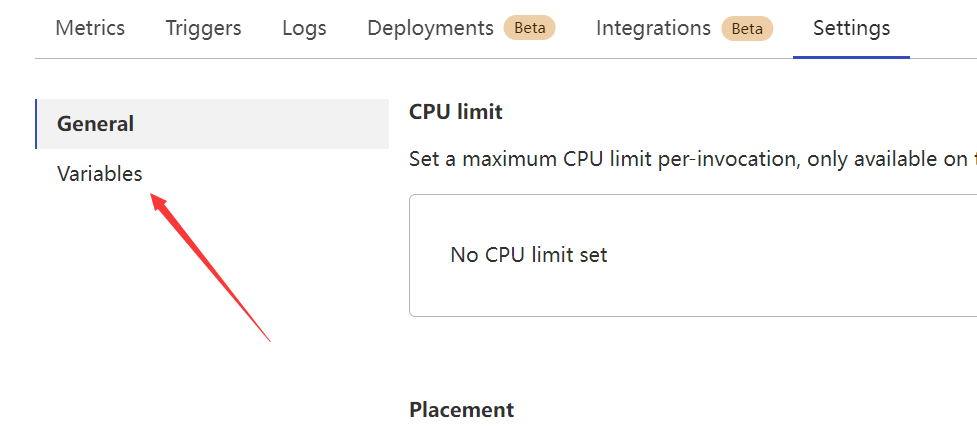

在右侧找到：

如图操作，之后点击Save and deploy：

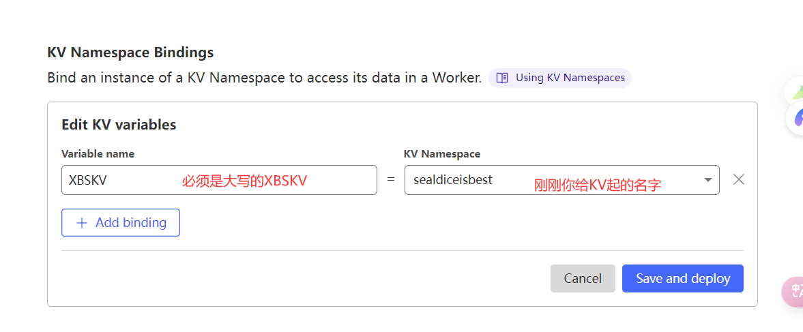

接下来您可以访问xxxxxxxxx.你的域名.你的后缀(本例是worker.example.com)，如果没有问题，你将会看到一句话：


## 修改源码

到https://github.com/sealdice/sealdice-core来clone一份海豹。之后修改”[dice](https://github.com/sealdice/sealdice-core/tree/d4b4708ee4d396257a15caa54983105846dd9871/dice)/utils_log_upload.go，将里面的

```go
var backendUrlsRaw = []string{
	"http://dice.weizaima.com",
}

var BackendUrls = []string{
	"http://dice.weizaima.com",
}
```

修改为你的地址：

```go
var backendUrlsRaw = []string{
	"https://worker.example.com",//注意，http要改成https
}

var BackendUrls = []string{
	"https://worker.example.com",//注意，http要改成https
}
```

然后重新编译的海豹就可以用辣。~~~（什么你问我为什么没有编译教程因为我不会go啊我如果会go我还抓包干啥直接分析源码不就得了什么你问我那编译没教程怎么办我也没办法啊我自己都不会编译呜呜呜）~~

总结：总共要设置两个地址，一个是染色器地址，一个是后端地址。
